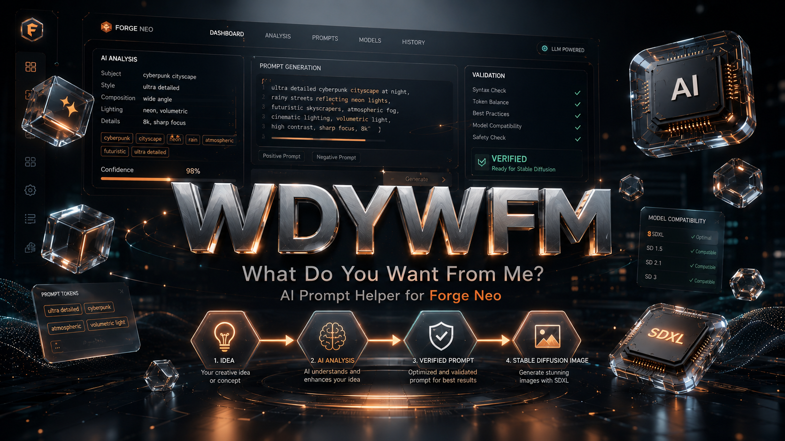

<div align="center">



# ai-wdywfm

### AI LLM SD WebUI Helper

**What Do You Want From Me?**

Turn a plain-language idea—or an image plus editing instructions—into Stable Diffusion prompts tailored to the checkpoints and LoRAs actually installed in Forge Neo.

[](https://github.com/Haoming02/sd-webui-forge-classic/tree/neo)
[](https://www.gradio.app/)
[](https://openrouter.ai/)
[](https://lmstudio.ai/)
[](docs/ROADMAP.md)

**English** · [Русский](docs/README_RU.md) · [한국어](docs/README_KO.md) · [日本語](docs/README_JA.md) · [简体中文](docs/README_ZH_CN.md) · [繁體中文](docs/README_ZH_TW.md)

[Overview](#overview) · [How it works](#how-it-works) · [Architecture](#architecture) · [Roadmap](docs/ROADMAP.md) · [Support the project](#support-the-project)

</div>

> [!IMPORTANT]
> The first executable MVP is available. It provides the Forge Neo UI, LM Studio and
> OpenRouter structured requests, text/vision input, validation, and explicit prompt-only
> apply. CivitAI metadata enrichment is available; advanced model retrieval remains roadmap work.

> [!NOTE]
> **Verified status.** Confirmed working end to end on the latest **Stable Diffusion WebUI
> Forge Neo**. So far only the **OpenRouter** provider has been verified in real use; LM
> Studio is implemented against the same contract but not yet confirmed end to end.
>
> The **recommended and verified model is `google/gemma-4-31b-it` (Gemma 4 31B)**, which
> also supports NSFW prompt generation. Any other LLM/model choice is **not guaranteed** —
> schema adherence, prompt quality, and content-policy behavior can differ significantly
> between models and providers.
>
> It is **strongly recommended to review and edit the generated prompt before
> generating an image** — treat every LLM suggestion as a draft, not a final prompt.
>
> If you are new to SDXL prompting, it's worth watching an in-depth guide such as
> [this video](https://www.youtube.com/watch?v=QdRP9pO89MY) and browsing
> [CivitAI](https://civitai.com) for model-specific techniques and examples.

## Quick start

1. Download the latest release archive from
   [github.com/mikhailfur/sd-webui-ai-wdywfm/releases/latest](https://github.com/mikhailfur/sd-webui-ai-wdywfm/releases/latest).
2. Extract the archive into Forge Neo's `extensions/` directory, so the extension's
   own folder (e.g. `sd-webui-ai-wdywfm`) ends up directly inside `extensions/`,
   not nested one level deeper.
3. Restart Forge Neo (fully close and relaunch the WebUI process — reloading the
   browser tab alone is not enough).
4. Open `LLM Prompt Helper · AI WDYWFM` under `txt2img` or `img2img`.
5. Keep the local-first default and start LM Studio at `http://127.0.0.1:1234/v1`,
   or select OpenRouter and provide a session-only key (the
   `OPENROUTER_API_KEY` environment variable is also supported).
6. Refresh/select a model, describe the result, and click `Generate verified draft`.
7. Review the preview and read-only recommendations, then click `Apply prompts`.

Provider choice, URL, model, and OpenRouter key are restored automatically after a
WebUI reload. On Windows, the saved key is encrypted for the current user with DPAPI.
Provider, LM Studio URL, provider timeouts, and thinking budget are available under
`Settings → AI WDYWFM`. All other behavior uses built-in defaults.

Every provider operation has a request id and is written to the rotating sanitized log
at `logs/ai-wdywfm.log`. Open `Diagnostics · sanitized log` in the panel to inspect or
copy recent events. API keys, prompt text, and images are never written to this log.

OpenRouter models in the Gemma 4 family use a fast structured-output profile with no
jailbreak, custom turn markers, or requested reasoning because reasoning repeatedly
caused slow, truncated schema responses. Output is capped at 2048 tokens. OpenRouter Response
Healing is enabled for structured JSON responses.

Forge caches safetensors headers. LoRA sidecar JSON is additionally cached in memory and
invalidated by file size/mtime; only the eight most request-relevant detailed LoRA cards
are sent, while the complete compact id allowlist remains available for validation.

## Overview

`ai-wdywfm` is a prompt assistant built specifically for **Stable Diffusion WebUI Forge Neo**. It helps beginners describe what they want without first learning prompt syntax, while giving experienced users a faster way to draft model-aware prompts.

The assistant combines:

- a natural-language request;
- an optional reference image and editing instruction;
- the active `txt2img` or `img2img` context;
- installed checkpoints and LoRAs;
- local model metadata and trigger words;
- full CivitAI model/version descriptions when available;
- a versioned system prompt and strict JSON Schema;
- OpenRouter or a local LM Studio server.

### The non-negotiable rule

After the LLM responds, the extension may update only:

- **Prompt**;
- **Negative Prompt**.

`CFG Scale`, dimensions, sampler, scheduler, sampling steps, denoising strength, and other generation settings are displayed as **read-only recommendations**. They are never wired to the corresponding Forge controls as outputs.

The checkpoint is never switched automatically. A LoRA may be added to the generated prompt as `<lora:name:weight>` only after its ID and alias have been verified against the local Forge Neo registry.

## Who is it for?

| User | What ai-wdywfm provides |
|---|---|
| **Beginner** | Converts a normal description into a usable positive and negative prompt. |
| **Advanced user** | Produces a model-aware draft with valid local LoRAs, trigger words, and compatibility warnings. |
| **Offline-first user** | Works with LM Studio and cached/local metadata without sending the request to a cloud LLM. |
| **Large model collector** | Builds a bounded, ranked context instead of dumping every full model description into the LLM context window. |

## How it works

### Text → prompt

```text
Natural-language idea
        ↓
Forge Neo checkpoint + LoRA inventory
        ↓
Local sidecars / safetensors metadata / CivitAI cache
        ↓
Relevant model ranking and bounded context
        ↓
OpenRouter or LM Studio + strict JSON Schema
        ↓
Validated preview
        ↓
Explicit “Apply prompts”
        ↓
Prompt + Negative Prompt only
```

1. Open the `AI WDYWFM` accordion in `txt2img` or `img2img`.
2. Describe the image you want in everyday language.
3. The extension detects the current checkpoint, LoRAs already referenced in the prompt, and relevant installed models.
4. Missing metadata is optionally enriched from CivitAI.
5. The selected LLM returns a structured suggestion.
6. The response is validated against the schema and the current Forge registries.
7. Review the prompts, recommendations, selected models, and warnings.
8. Click `Apply prompts` to update only the positive and negative prompt fields.

### Image + instruction → prompt

1. Attach an image inside the assistant panel.
2. Describe what should be changed, preserved, removed, or restyled.
3. A sanitized and resized copy is sent to a vision-capable model.
4. The LLM analyzes the image together with the local model context.
5. The same validation and explicit apply flow is used.

The extension owns its image input, so this workflow is available in both `txt2img` and `img2img` and does not depend on a particular img2img sub-mode.

## Interface

The `AI WDYWFM` panel is an `AlwaysVisible` Forge script rendered independently in both generation tabs.

| Control | Purpose |
|---|---|
| Natural request | Describe the desired result or edit. |
| Reference image | Optional visual input for a vision-capable LLM. |
| Create / Edit | Select the intent of the request. |
| Prompt dialect | `Auto`, `Booru tags`, or `Natural language`. |
| Provider / model | Choose LM Studio or OpenRouter and a compatible model. |
| Model context preview | See which local model metadata will be included. |
| Generate suggestion | Start the explicit LLM request. |
| Prompt preview | Review positive and negative prompts before applying. |
| Recommendations | Read-only CFG, size, sampler, scheduler, and steps. |
| Apply prompts | Replace or append only the active tab's prompt fields. |

The existing prompt is not overwritten until the user presses `Apply prompts`. The planned default is `Replace with preview`; `Append` remains an explicit alternative.

## Forge Neo compatibility

Target environment:

- [Stable Diffusion WebUI Forge — Neo](https://github.com/Haoming02/sd-webui-forge-classic/tree/neo), branch `neo`;
- Gradio `4.40.0`, used by Forge Neo;
- `modules.scripts`, `modules.script_callbacks`, and `modules.shared`;
- the built-in Neo LoRA module at `extensions-builtin/sd_forge_lora`.

The design uses `scripts.AlwaysVisible` and captures the official prompt components by their Neo IDs:

| Tab | Positive prompt | Negative prompt |
|---|---|---|
| txt2img | `txt2img_prompt` | `txt2img_neg_prompt` |
| img2img | `img2img_prompt` | `img2img_neg_prompt` |

No Forge core files are patched. Forge Classic, AUTOMATIC1111, reForge, and other WebUIs are outside the compatibility guarantee.

## Model-aware CivitAI integration

CivitAI support is implemented inside `ai-wdywfm`; **CivitAI Browser Neo is not a runtime dependency**.

Metadata is resolved field-by-field. Local identity and trigger sources are read first; remote enrichment is cache-first:

1. `<model>.api_info.json`;
2. `<model>.json`;
3. `.safetensors` `__metadata__` header;
4. a fresh snapshot in `data/ai-wdywfm/cache.sqlite3`;
5. for a shortlisted cache miss, `GET /api/v1/model-versions/by-hash/{sha256}`;
6. fallback `GET /api/v1/model-versions/{versionId}`;
7. `GET /api/v1/models/{modelId}` for model-level descriptions and tags.

Only `https://civitai.com/api/v1` and `https://civitai.red/api/v1` are accepted. Authentication is optional;
`CIVITAI_API_TOKEN` has priority over `CIVITAI_TOKEN`. Retries are limited to rate limits, server failures,
and transport failures. A cached 404 prevents repeated lookup loops, and an offline CivitAI request falls
back to local or stale metadata without blocking prompt generation.

Normalized metadata includes model identity, type, base-model family, hashes, CivitAI IDs, trigger-word groups, model/version descriptions, sample prompts, negative prompts, and field-level provenance.

Large model files are hashed lazily in a bounded worker pool and only after entering the shortlist. The
first LLM request contains compact LoRA cards (`id`, `alias`, and a description of at most 140 characters).
Compatible models can request up to eight full cards through the bounded `get_lora_details` tool; models
without tool calling receive the previous static top-eight fallback.

The separate **LoRA recommender · CivitAI** accordion searches `civitai.com` or `civitai.red` with pagination,
base-model and NSFW filters. It can optionally use the selected LLM for re-ranking. Results are read-only
names, creator/base-model metadata, previews, model/version ids, and links—nothing is downloaded, installed,
or inserted into the prompt.

## LLM providers

### LM Studio — local-first default

- Default base URL: `http://127.0.0.1:1234/v1`.
- OpenAI-compatible `/models` and `/chat/completions` endpoints.
- Structured Output using the same JSON Schema contract.
- Configurable token thinking budget via `reasoning_tokens` (LM Studio 0.4.8+).
- Vision workflow when the selected local model supports image input.
- Can operate entirely locally with cached CivitAI metadata.

### OpenRouter

- Endpoint: `https://openrouter.ai/api/v1/chat/completions`.
- Text and multimodal models.
- Strict Structured Outputs on compatible models.
- Configurable token thinking budget via `reasoning.max_tokens`.
- Requires endpoint support for every requested parameter and routes fallbacks by throughput.
- `OPENROUTER_API_KEY` environment variable is the preferred secret source.

Provider `finish_reason=error` and truncated `finish_reason=length` responses are surfaced
directly instead of being misreported as malformed prompt JSON. Cancel stops the extension's
wait immediately; an upstream provider may still finish an HTTP request already in flight.

Both adapters produce the same provider-neutral domain object. Invalid or incomplete responses are never applied.

### Character-aware web search

Phase C adds an opt-in `web_search` tool shared by LM Studio and OpenRouter. It searches character-category
tags and repeated visual traits on Danbooru/e621, supplemental Rule34 tags, and canonical plain-text
summaries from an allowlisted Fandom wiki. The model uses this context to produce more accurate, detailed
character prompts while ignoring artist/rating/meta tags and unrelated or transient post attributes.

Web search is available in the panel but remains off for each Generate until the user explicitly enables
its consent checkbox. Search content is bounded, sanitized, treated as untrusted data, never stored in the
metadata cache, and shares the LLM hard deadline. Models without tool calling receive a single backend
prefetch compatibility context.

## Structured response contract

The canonical schema is [prompt_suggestion.v1.json](schemas/prompt_suggestion.v1.json). A response contains:

```json
{
  "schema_version": "1.0",
  "prompt": "masterpiece, best quality, neon city, night, rain",
  "negative_prompt": "worst quality, blurry, text, watermark",
  "models": {
    "checkpoint_id": null,
    "loras": []
  },
  "recommendations": {
    "sampler": "Euler a",
    "scheduler": "Automatic",
    "sampling_steps": 28,
    "cfg_scale": 5,
    "width": 832,
    "height": 1216,
    "denoising_strength": null
  },
  "summary": "Vertical neon-lit night scene.",
  "warnings": []
}
```

Only `prompt` and `negative_prompt` can be applied to Forge. Model IDs, LoRA weights, samplers, schedulers, and value ranges undergo an additional semantic validation against the live Neo registries.

See the complete [LLM Protocol](docs/LLM_PROTOCOL.md).

## Architecture

```text
Forge Neo UI
    │
    ▼
Application use cases
    │
    ▼
Domain models and policies
    │
    ├── Forge Neo inventory adapter
    ├── Sidecar / safetensors readers
    ├── CivitAI metadata adapter
    ├── OpenRouter provider adapter
    ├── LM Studio provider adapter
    └── SQLite cache
```

Planned project layout:

```text
sd-webui-ai-wdywfm/
├── install.py
├── requirements.txt
├── scripts/
│   └── ai_wdywfm.py
├── ai_wdywfm/
│   ├── application/
│   ├── domain/
│   ├── infrastructure/
│   │   ├── civitai/
│   │   ├── forge_neo/
│   │   ├── providers/
│   │   └── storage/
│   ├── prompts/
│   └── ui/
├── javascript/
│   └── ai_wdywfm.js
├── schemas/
│   └── prompt_suggestion.v1.json
├── tests/
└── docs/
```

Read the complete [Architecture document](docs/ARCHITECTURE.md).

## Privacy and security

> [!NOTE]
> No request is sent automatically. Network access begins only after an explicit user action.

- API keys are excluded from LLM payloads, cache, and logs.
- Absolute local paths are never sent to a provider.
- CivitAI descriptions and model metadata are treated as untrusted data, not instructions.
- Cloud image upload requires explicit consent.
- Character web search requires explicit consent for each Generate.
- A provider disclosure shows whether text, image, and model metadata will be sent.
- Reference images are verified, resized, stripped of metadata, and re-encoded.
- Unknown checkpoint, LoRA, embedding, sampler, or scheduler names are rejected.
- The extension never starts generation, downloads a model, or executes LLM-produced text.
- Prompt content, images, secrets, and full provider responses are omitted from default logs.
- Diagnostics have independent subsystem verbosity, stable error categories, request/level filters, and an
  optional JSONL file format.

## MVP configuration

| Setting | Default | Purpose |
|---|---:|---|
| Default LLM provider | `LM Studio` | Local-first safe default. |
| LM Studio base URL | `http://127.0.0.1:1234/v1` | OpenAI-compatible local server. |
| OpenRouter timeout | `60 seconds` | OpenRouter request timeout. |
| LM Studio timeout | `180 seconds` | LM Studio request timeout (local generation is usually slower). |
| Thinking budget | `2,048 tokens` | Both providers; `0` uses the model/provider default. |

These are the only exposed extension settings. All metadata, search, image, auto-unload,
recommender, and diagnostics options continue to use their built-in defaults.

## MVP acceptance criteria

- [ ] Forge Neo starts with the extension without core patches.
- [ ] The assistant works independently in `txt2img` and `img2img`.
- [ ] Checkpoints and LoRAs are discovered through the Neo registries.
- [ ] Local sidecars in `docs/LoRA json exmples/` normalize correctly.
- [ ] CivitAI lookup works by SHA-256 and remains cache-first.
- [ ] OpenRouter and LM Studio return the same domain object.
- [ ] Text and vision workflows pass end to end.
- [ ] `Apply prompts` changes exactly two fields in the active tab.
- [ ] Recommendations never mutate CFG, dimensions, sampler, scheduler, or steps.
- [ ] Invalid LLM output cannot be applied.

## Documentation

- [Architecture](docs/ARCHITECTURE.md)
- [LLM Protocol](docs/LLM_PROTOCOL.md)
- [Roadmap](docs/ROADMAP.md)
- [Prompt examples](docs/promptexmaple.md)
- `docs/LoRA json exmples/` — local metadata fixtures
- `docs/sd-civitai-browser-neo-main/` — studied Forge Neo CivitAI reference

External references:

- [Forge Neo](https://github.com/Haoming02/sd-webui-forge-classic/tree/neo)
- [OpenRouter Structured Outputs](https://openrouter.ai/docs/guides/features/structured-outputs)
- [OpenRouter Image Inputs](https://openrouter.ai/docs/guides/overview/multimodal/image-understanding)
- [LM Studio OpenAI compatibility](https://lmstudio.ai/docs/developer/openai-compat)
- [LM Studio Structured Output](https://lmstudio.ai/docs/developer/openai-compat/structured-output)
- [CivitAI REST API reference](https://github.com/civitai/civitai/wiki/REST-API-Reference)

## Out of scope for the first release

- Automatic image generation.
- Automatic checkpoint switching.
- Automatic mutation of generation parameters.
- Downloading recommended models.
- LoRA training.
- Cloud synchronization of prompt history.
- Agentic command execution.

The first release is intentionally a predictable prompt assistant—not an autonomous WebUI operator.

## Support the project

If `ai-wdywfm` saves you time and you would like to support its development:

| Asset / network | Address |
|---|---|
| **USDT (TRC-20)** | `TJWZfYHvis7B1uzxhCeenvtzaAFNipzjhz` |
| **LTC** | `LgRVpM8DRrae4ZKeFen39Z5FNXcQfeZtWL` |
| **ETH** | `0x60d1ab93862336241aa77fdf9c7e32e9f9ddf688` |

> [!CAUTION]
> Always verify both the address and the selected network before sending. Cryptocurrency transactions are irreversible.

---

<div align="center">

Built for **Stable Diffusion WebUI Forge Neo**.

[Back to top](#ai-wdywfm)

</div>
